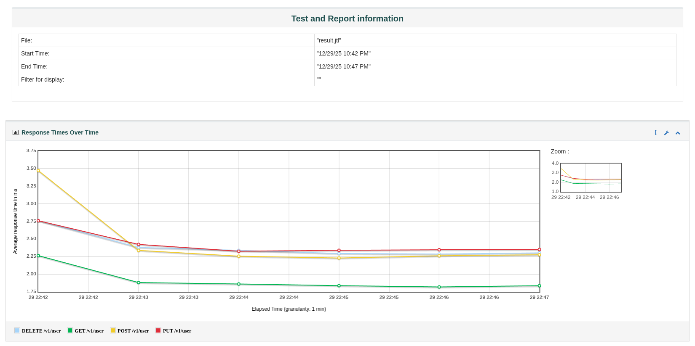
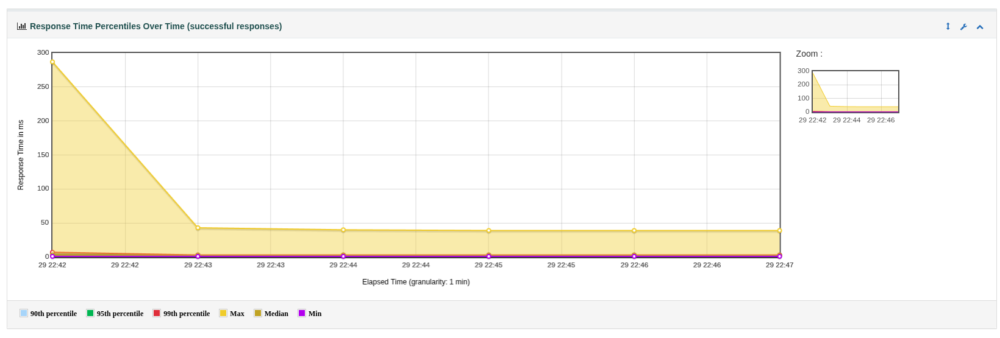
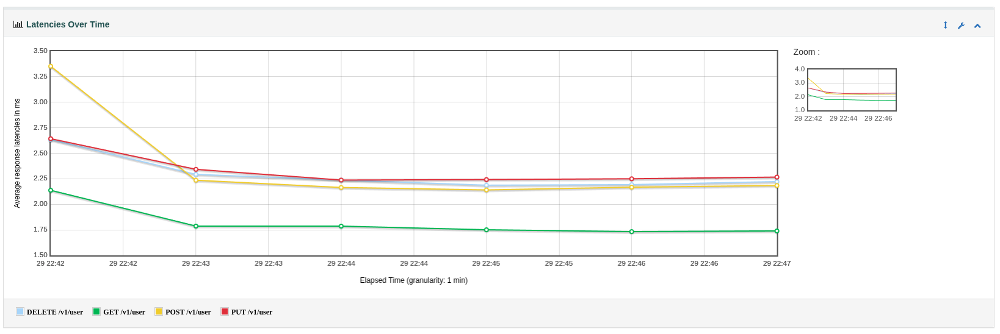
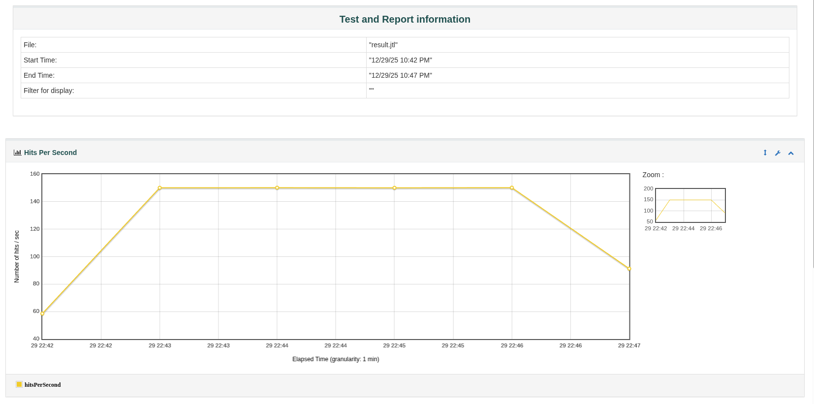
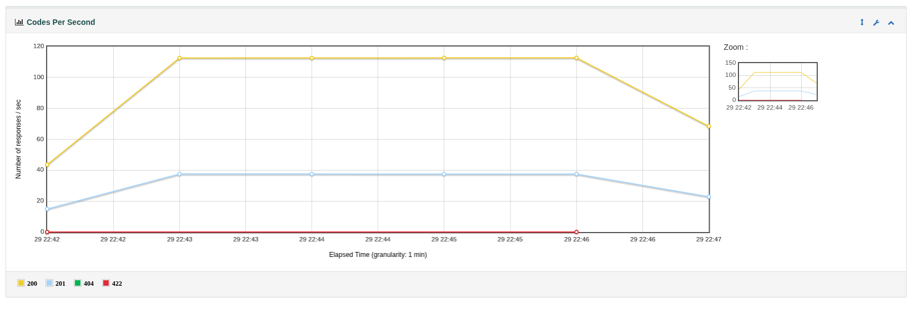
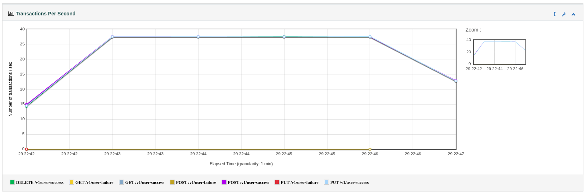
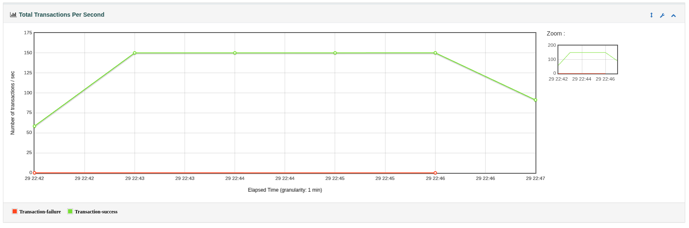

## Objetivo do projeto

API de usuários simples em container que é capaz de se comunicar com mongoDB e Redis

* Endpoint de Health Check - OK
* Endpoint de consulta de usuários
    * Consultar primeiro no Redis. Se não existir, consultar no MongoDB e salvar no Redis com TTL de 5 minutos OK
* Endpoint de cadastro de usuários OK
* Endpoint de alteração de usuários OK
* Endpoint de remoção de usuários OK

* Tudo feito em containers
* API expondo endpoints em SSL OK
* Container non-keepalive que apenas gera os certificados para o MongoDB, o Redis e a API. OK
* Os 3 certificados devem ser diferentes OK
* A API deve confiar nos certificados do Redis e do MongoDB OK

Resultados obtidos:

